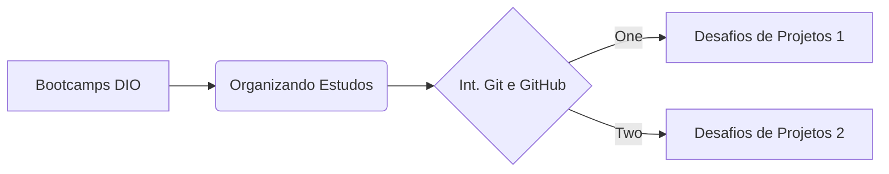

# **Desafio de Projeto sobre Git/GitHub da DIO** :octocat:

> ## 🧾**Descrição**

<h4 align="center"> 🚧 Projeto em Construção🚧</h4>

Sejam Bem-Vindos (a)

Repositório criado para o desafio de Projeto sobre Git/GitHub.  
Aqui você encontrará algumas anotações pessoais de alguns cursos realizados na plataforma da DIO.  Espero que esse repositório te ajude a trilhar essa nova jornada rumo ao mundo da tecnologia.

> ## 📲**Conecte-se Comigo**

<h4 algin="center"> 🚧Em Construção🚧</h4>
  
> ## **Lista dos cursos**

- Bootcamps DIO: Educação Gratuita e Empregabilidade Juntas!
- Organizando seus Estudos com os Roadmaps e Notion
- Introdução ao Git e ao GitHub
- Desafios de Projetos 1
- Desafios de Projetos 2

> ## **Seqência Evolução Apendizado**

> ## ⚒️**Técnicas e Tecnologias Utilizadas**

- `Marckdown`
- `HTML`
- `VsCode`

> ## **Autores**

<h4 algin="center"> 🚧Em Construção🚧</h4>

> ## 🔗**_Links Úteis_**

[Sintaxe Básica marckdown](https://www.markdownguide.org/basic-syntax/)

[Documentação de introdução ao GitHub](https://docs.github.com/pt/get-started)

[Para cria Badge](https://shields.io/)

[Crie sue Octocat](https://myoctocat.com/)
